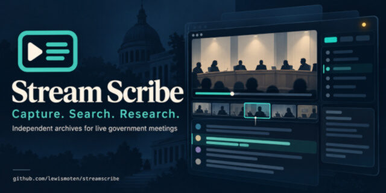

# Stream Scribe



Stream Scribe keeps an independent archive of public meetings that are streamed live. It records the livestream, fills any gaps from the official recording, and transcribes it on your own computer with Whisper. Then you can review a meeting: who spoke, the agenda, and the votes. Publish notes, transcripts, and clips, each linked back to the official sources.

## Three ways to use it

|                                    | What you get                                                              | What you need                    |
| ---------------------------------- | ------------------------------------------------------------------------- | -------------------------------- |
| **On your computer**               | Everything: capture livestreams, transcribe, review, and the web app      | Node.js 24, ffmpeg, whisper.cpp  |
| **In your browser** (GitHub Pages) | The web app, with your data kept in your browser                          | A fork of this repository        |
| **With a hub**                     | A shared archive: recorders on a schedule, accounts, publishing, podcasts | PHP 8 hosting (or someone's hub) |

### On your computer

You need [Node.js](https://nodejs.org) 24 or later, [ffmpeg](https://ffmpeg.org), and [whisper.cpp](https://github.com/ggerganov/whisper.cpp) (`brew install ffmpeg-full whisper-cpp` on a Mac). You also need a Whisper model, such as `ggml-large-v3.bin`, and the Silero VAD model, both in `~/.cache/whisper-cpp/`.

```bash
npm install
cp config.example.js config.local.js   # add your sources: the livestreams to record
npm run build
npm start                              # http://127.0.0.1:4873
```

Capture a meeting from the Capture page, then run `npm run transcribe` and review it from the library. [A meeting, start to finish](docs/guide.md) walks through it.

### In your browser

Fork this repository. In its Settings → Pages, choose **GitHub Actions** as the source, then run the **Pages** workflow from the Actions tab. You get the web app at `https://<you>.github.io/<repository>/`. Each visitor's data stays in their own browser (IndexedDB): schedules, and anything imported under Settings.

To show a hub's meetings and publications instead, set the repository variable `PAGES_HUB_URL` to its address (such as `https://example.com/hub/api.php`) and run the workflow again. Visitors can also enter a hub address under Settings.

### With a hub

The hub is a small PHP and SQLite service for ordinary shared hosting.

- **What it holds:** schedules, the meetings recorders send it (private, for the people you allow), accounts and groups, and what you publish for everyone.
- **Agents:** recorders that record on a schedule and do the heavy work. Install one on a Raspberry Pi with a single command from the hub's Agents page.
- **Setup:** `npm run deploy:hub`, or the Deploy hub workflow, puts the hub and the web app on your server. See [the hub](docs/hub/hub.md) and [deploying it](docs/hub/deploy.md).

## Documentation

- **Using it:**
  - [A meeting, start to finish](docs/guide.md)
  - [All commands](docs/commands.md)
  - [Capture](docs/capture/capture.md)
  - [Transcription](docs/transcription/transcribe.md)
  - [The review page](docs/review/extract-thumbnails.md)
  - [Full meetings from the archive](docs/archive/build-meeting.md)
- **Sharing it:**
  - [The hub](docs/hub/hub.md)
  - [Deploying](docs/hub/deploy.md)
  - [Recorders and agents](docs/recorder/recorder.md)
  - [Audio, video, and the podcast](docs/media/publish-media.md)
- **Working on it:** [development](docs/development.md) covers the layout, conventions, and `npm run check` (format, lint, types, tests).
